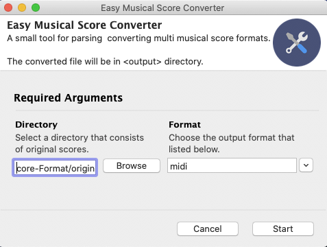

# Score-Format-Converter
A small tool for parsing &amp; converting multi musical score formats using music21, and Gooey for GUI assembled. 



Select the directory that consists of the original musical scores, then choose a format (e.g. midi, xml, abc, etc.)that you want to convert to, hit "start" button. 
The converted scores will be placed in the "output" folder under the original scores' directory.
## Setup
Add these required python packages using `pip install`
- [music21](https://github.com/cuthbertLab/music21)
- [Gooey](https://github.com/chriskiehl/Gooey)

Run the code
```shell
pythonw score-format-converter.py
```
## 

## ToDo
- expend the functionality.
- package it as a standalone app (.exe & .app).
